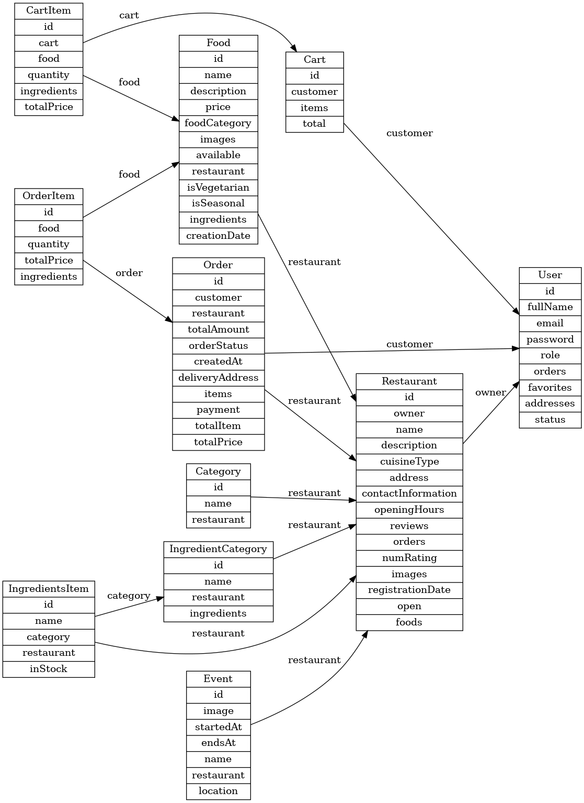
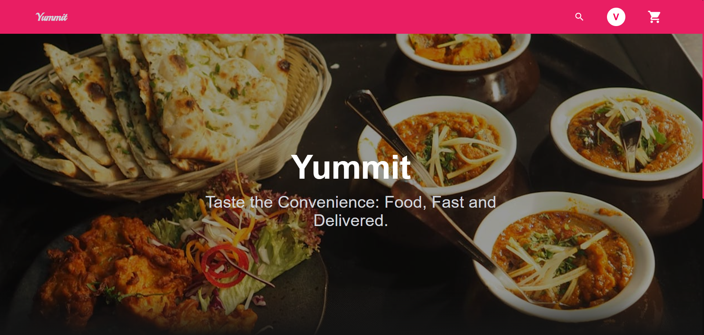
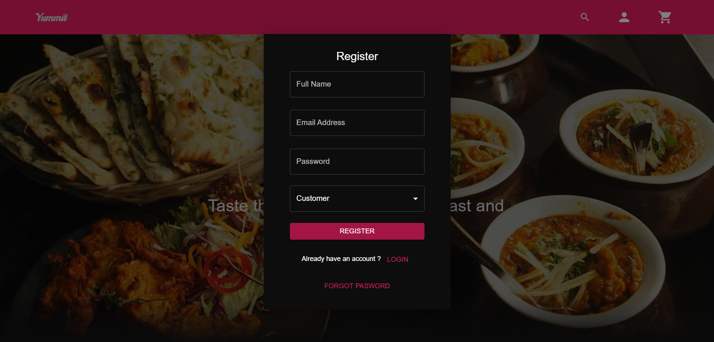
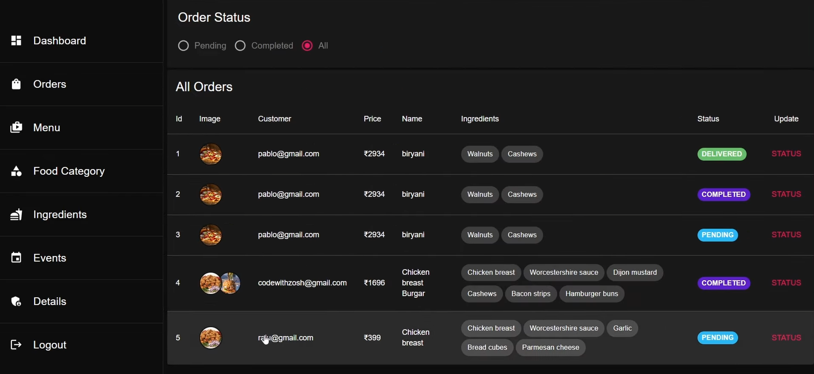

# 🍽 Online Food Ordering System

A full-stack  food delivery platform that allows users to browse restaurants, explore food menus, place orders, and make secure payments. The system supports role-based access for customers and restaurant owners, enabling dynamic management of restaurants, food items, orders, and events.

---

## 🚀 Tech Stack

### 🌐 Frontend
- React.js
- Tailwind CSS
- MUI (Material UI)
- Redux (State Management)
- Axios

### ⚙ Backend
- Spring Boot
- Spring Security
- JWT Authentication
- Spring Mail
- MySQL

---

## 👥 Role-Based Access

- *Customer*
  - Browse restaurants and menus
  - Add items to cart and place orders
  - View past orders, update addresses, and mark favorites

- *Restaurant Owner*
  - Manage restaurant profile, food items, orders, events, and reviews
  - View ratings, add ingredients, and manage availability

---

## 🧩 Features

- 🧑‍🍳 Multi-role access: Customer & Restaurant Owner
- 📦 Cart and Order Management
- 🔍 Filter food by category, cuisine, and veg/non-veg
- 📧 Email Notifications (via Nodemailer / Spring Mail)
- 💳 Secure Payments using Stripe
- 📅 Restaurant Events and Offers
- 🔒 JWT-based secure login/logout
- 🖼 Image upload for restaurant and food

---

## 🗂 Database Models (Simplified)

### User
- id, fullName, email, password, role, orders, favorites, addresses, status

### Restaurant
- id, owner, name, description, cuisineType, foods, reviews, contactInformation, openingHours, images

### Food
- id, name, description, price, category, ingredients, restaurant, available, isVegetarian

### Order & Cart
- Order: customer, restaurant, items, totalPrice, payment
- Cart: customer, items, total, CartItem (food + quantity + ingredients)

### Schema Diagram

### Home Page

### Registration Page

### Dashboard

